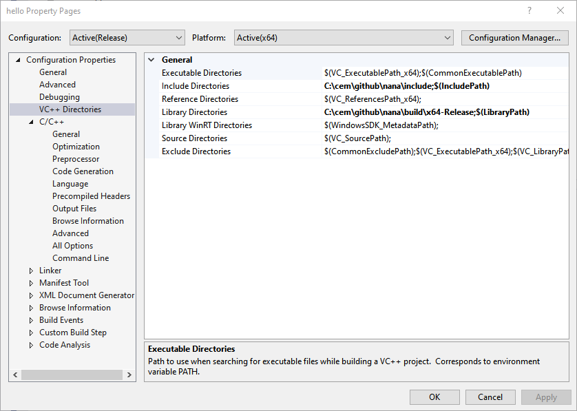
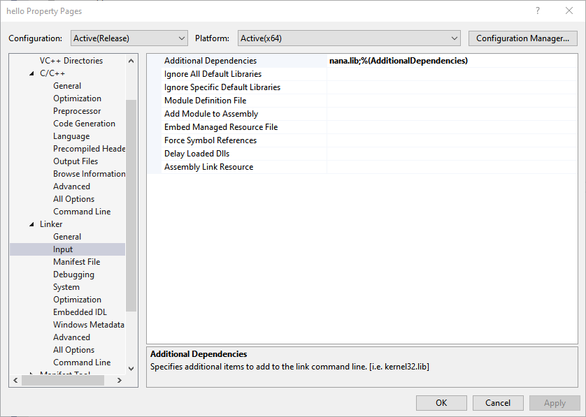
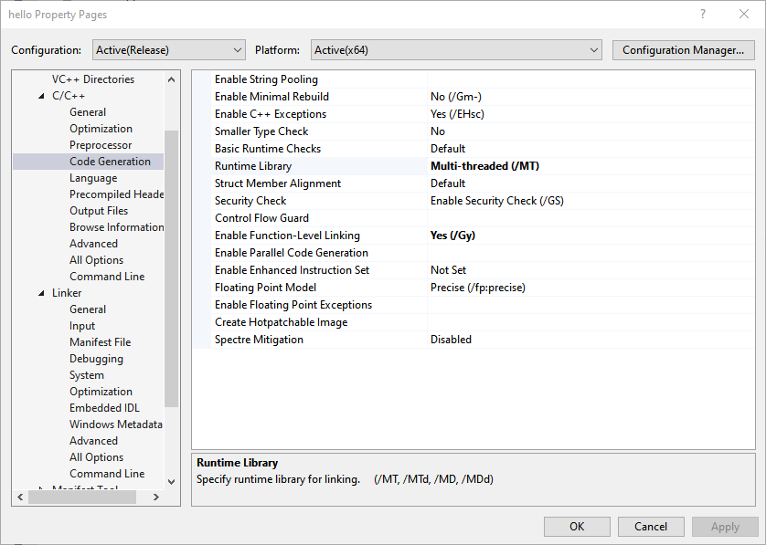
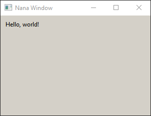

# Install nana

References:

  1. Official [nana installation guideline](https://github.com/qPCR4vir/nana-docs/wiki/Installation)
  2. Nana on [MS Visual Studio](https://github.com/qPCR4vir/nana-docs/wiki/MS-Visual-Studio)

## Grab and compile nana.lib

Nana is easy to install.

### grab nana

Grab [nana](https://github.com/cnjinhao/nana). Fork and clone
```bash
git clone git@github.com:cnjinhao/nana.git
```
now the header files are located in `~/cem/github/nana/include`, this folder is called `NanaInc`.

### compile using VS2019

Install Visual studio community 2019, choose `[x] Desktop development with C++`.

Now you have two options,
  1. Compile `nana.lib` using the template in `build/vc2019`, which is straight forward, open `nana.vcxproj`, and build this solution. **Warning**: choose the right C++ language standard in `General` tab, currently (2019/09/15), C++ 17 compiles fine.
  2. Compile `nana.lib` using `C++ CMake` in `Visual studio 2019`. Select `Open a local folder`, then `cmake` will automatically locate `CMakeLists.txt` and the settings in `build/cmake`, the build this solution.

In either way, you have `nana*.lib`,
  1. `nana\build\bin\nana_v142_Release_x64.lib`
  2. `nana\build\x64-Release\nana.lib`

The location of this file is called `NanaLib`.

### The location of Third-party libraries

Third-party libraries, such as `eigen`, can be placed at `nana\extrlib`. This folder is called `NanaExt`.

## hello, nana

Now we use a simple demo in [nana doc](http://nanapro.org/en-us/blog/2016/05/an-introduction-to-nana-c-library/).

```cpp
//Include nana/gui.hpp header file to enable Nana C++ Library
//for the program.
#include <nana/gui.hpp>

//Include a label widget, we will use it in this example.
#include <nana/gui/widgets/label.hpp>

int main()
{
    //All names of Nana is in the namespace nana;
    using namespace nana;

    //Define a form object, class form will create a window
    //when a form instance is created.
    //The new window default visibility is false.
    form fm;

    //Define a label on the fm(form) with a specified area,
    //and set the caption.
    label lb{ fm, rectangle{ 10, 10, 100, 100 } };
    lb.caption("Hello, world!");

    //Expose the form.
    fm.show();

    //Pass the control of the application to Nana's event
    //service. It blocks the execution for dispatching user
    //input until the form is closed.
    exec();
}
```

Create a empty project, and set the following directories,

  1. set the `NanaInc` path in `Include Directories`,
  
  2. set the `NanaLib` path in `Library Directories`.
  3. set the approporiate `nana.lib` in the input of Linker,
  
  4. set the runtime compile options. In [MS Visual Studio](https://github.com/qPCR4vir/nana-docs/wiki/MS-Visual-Studio), *MDd and MTd for Debug Mode; MD and MT for Release Mode. Choosing the MD/MDd or MT/MTd depends on the property which is chose for building the Nana.* We choose `MT` for the `release version`.
  

Save, and compile, you can see the first nana GUI window.



